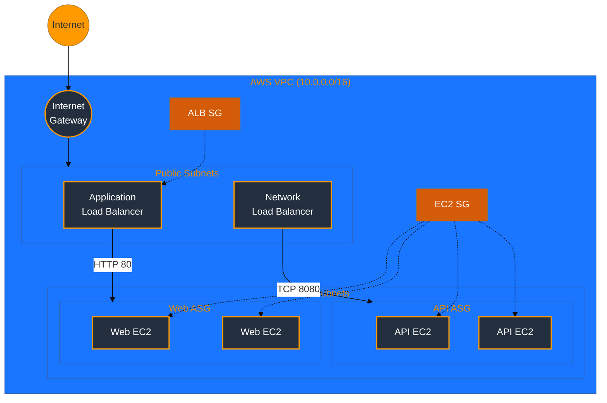

```mermaid

%%{init: {'theme': 'base', 'themeVariables': { 'primaryColor': '#ff9900', 'edgeLabelBackground':'#fff'}}}%%
flowchart TD
    classDef aws fill:#232F3E,color:white,stroke:#FF9900,stroke-width:2px
    classDef vpc fill:#2E27AD,color:white
    classDef public fill:#4FA6FF,color:black
    classDef private fill:#7FBFFF,color:black
    classDef security fill:#D45B07,color:white

    Internet((Internet))
    
    subgraph VPC["AWS VPC (10.0.0.0/16)"]
        class VPC vpc

        
        IGW(("Internet\nGateway")):::aws
        
        subgraph Public["Public Subnets"]
            class Public public
            ALB["Application\nLoad Balancer"]:::aws
            NLB["Network\nLoad Balancer"]:::aws
        end
        
        subgraph Private["Private Subnets"]
            class Private private
            
            subgraph WebASG["Web ASG"]
                Web1["Web EC2"]:::aws
                Web2["Web EC2"]:::aws
            end
            
            subgraph APIASG["API ASG"]
                API1["API EC2"]:::aws
                API2["API EC2"]:::aws
            end
        end
        
        ALB_SG["ALB SG"]:::security
        EC2_SG["EC2 SG"]:::security
    end

    Internet --> IGW
    IGW --> Public
    ALB -->|HTTP 80| WebASG
    NLB -->|TCP 8080| APIASG
    ALB_SG -.-> ALB
    EC2_SG -.-> Web1 & Web2 & API1 & API2

    
```